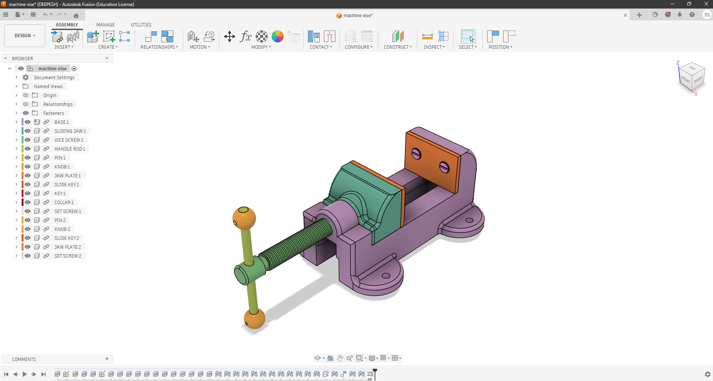
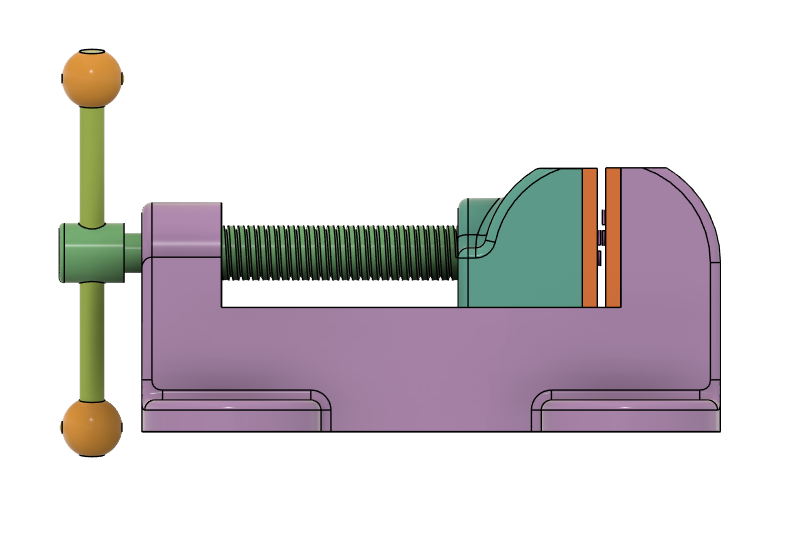

# Machine Vise Assembly

A detailed **Fusion 360 CAD project** showcasing the modeling, assembly, exploded view, and motion simulation of a machine vise.

---

## Project Highlights
- Part modeling of individual machine vise components
- Assembly using joints and constraints
- Exploded view for clear component visualization
- Motion simulation to demonstrate working mechanism

---

## Project Gallery

### Isometric View

### Front View

### Top View

### Exploded View

---

## Motion Demonstration
- [Joint Animation](./joint-animation.mp4)
- [Exploded View Animation](./explode-view-animation.mp4)

---

## Tools Used
- Fusion 360

---

## Project Outcome
This project helped strengthen my understanding of **3D part modeling, assembly relationships, motion study, and mechanical visualization** in Fusion 360.
