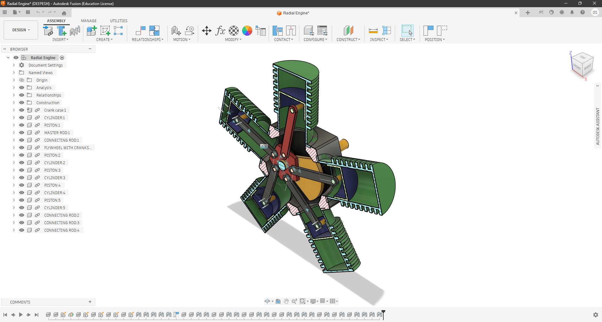

# Radial Engine Assembly

A detailed **Fusion 360 CAD project** showcasing the modeling, assembly, and motion simulation of a radial engine.

---

## Project Highlights
- 3D modeling of radial engine components
- Assembly using joints and constraints
- Motion simulation to demonstrate mechanism movement
- Mechanical visualization of engine structure

---

## Project Gallery

### Isometric View

---

## Motion Demonstration
[Watch Engine Motion Animation](https://drive.google.com/file/d/1fexGiHVIwQEoLiCeYKteYyuU31ht6OLT/view?usp=sharing)

---

## Tools Used
- Fusion 360

---

## Project Outcome
This project helped strengthen my understanding of **3D part modeling, assembly relationships, motion study, and mechanical visualization** in Fusion 360.

